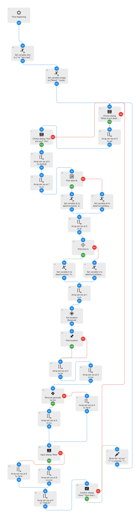

# howst-track
An Automate flow, a python cli program and to track humor and mental health variables

## Flow
[Install on Automate](https://llamalab.com/automate/community/flows/40914)


## Python CLI

 ``` bash
pip3 install -r requirements.txt
python3 main.py
```


[](https://asciinema.org/a/gCMkjXSLEwoZ2oL9oY9vVRrWd)


## Decription:

These programs keep a csv file with records of your mood data as you may input.

The automate flow is invoked through its notification.

## Use case:

* keeping track of mood and mental health
* recording episodes
* general purpose health-logging


## Suggestions

Bind the python program to an i3 keybinding


