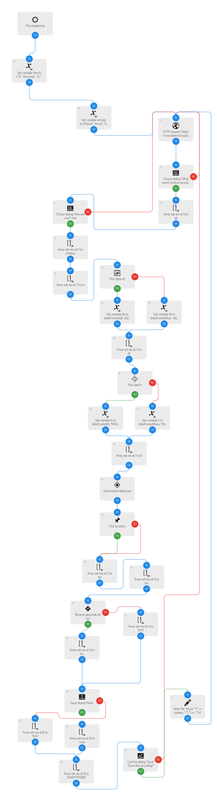

# howst-track
An Automate flow to track humor and mental health variables

## Flow

## Decription:

This automate flow keeps a csv file with records of your mood data as you may input through the notification.

## Use case:

* keeping track of mood and mental health
* recording episodes
* general purpose health-logging

